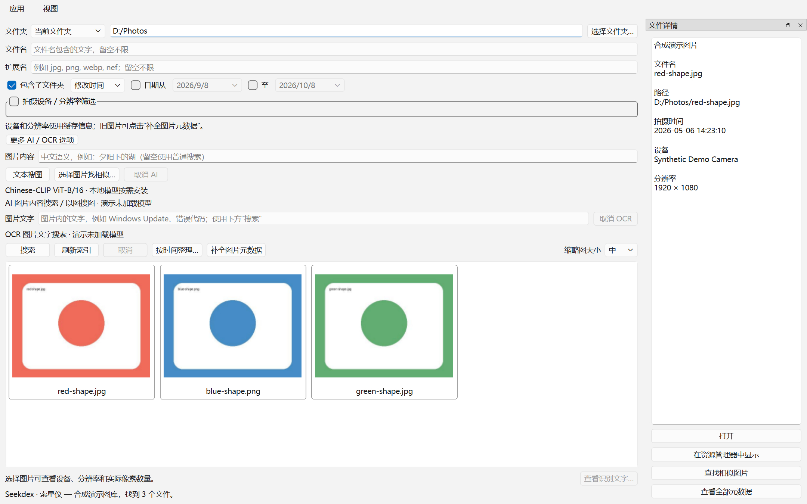
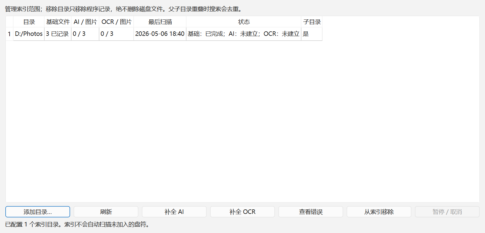

# Seekdex

**Local search, beyond filenames.**

**Seekdex · 索星仪**是一款开源、本地优先的智能文件与图片搜索工具。不止文件名的本地智能搜索。

当前版本：**0.5.0-rc1 — Unsigned Release Candidate**，不是正式 0.5.0。Python 包版本为等价的 `0.5.0rc1`。Windows 是目前实际验证平台；Linux support planned，尚不声明官方支持。

## Introduction

通过文件名、元数据、中文图片语义、相似图片和 OCR 文字组合筛选本地文件。SQLite 索引、模型和处理结果存于本机。选择目录不会自动扫描其他驱动器。

## Screenshots





截图使用合成图片与虚构路径，不含私人照片。见[来源说明](docs/screenshots/README.md)。

## Features

- 图片和普通文件搜索，多目录、文件名、扩展名、日期筛选。
- 拍摄设备、宽高、像素数、方向和分辨率级别筛选。
- SQLite 增量索引、渐进搜索、后台任务和取消。
- 可见区域缩略图 / 元数据懒加载、磁盘缓存、EXIF 拍摄时间。
- JPG / PNG / WebP / NEF / NRW，列表 / 网格 / 详情，系统默认程序打开。
- 时间整理预览、复制 / 移动、冲突处理、日志和安全撤销。
- Chinese-CLIP 中文语义搜图、以图搜图、本地 OCR。
- 首次启动向导、设置中心、索引管理与旧数据迁移。

## Metadata Search

选择目录，可勾选子目录。文件名不区分大小写；扩展名可输入 `jpg,png,nef`。日期可用修改时间或拍摄时间，两端包含当天。相机、宽高、MP、方向和 Full HD / 4K / 8K 条件可以组合；旧图库通过“补全图片元数据”获取缺失信息。

拍摄时间：EXIF DateTimeOriginal → DateTimeDigitized → 可靠完整 GPS UTC 时间 → 修改时间，不改 EXIF。图片尺寸按方向校正；RAW 尺寸来自文件头，缩略图优先内嵌预览。无法解码仍保留可搜索文件。

首次搜索边扫描边返回结果，同时保存轻量索引，不预先解码全部照片。完整索引以后直接查询 SQLite；目录变化后点击“刷新索引”。取消保留 partial 索引，下次先查已有数据再补扫。缩略图只处理可见区域和少量预加载，小 / 中 / 大共用缓存。

## AI Semantic Search

安装 Chinese-CLIP ViT-B/16，为所选图库建立 AI 索引，然后输入中文描述或选择图片找相似图。普通筛选同时生效。相关度是归一化向量 cosine，不是概率。模型能力与候选范围会影响结果。

支持 PyTorch CPU、可用时 CUDA 和 OpenVINO CPU / GPU / AUTO，检测设备并降级。切换后端不改变 model_id、512 维 embedding 空间或要求全部重建。

## OCR Search

按需安装 RapidOCR / ONNX Runtime 和 PP-OCRv6 small，为当前范围建立文字索引，然后在“图片文字”输入查询。可取消 / 续建，与目录、元数据和 AI 组合。OCR 建索引时仍可使用普通搜索和已建立的 AI 搜索。识别可能漏字或误字。

## File Organizer

选择整个目录或当前结果，指定目标、复制 / 移动和模板，例如 `{year}y/{month}m/{day}d/{filename}` 或 `{year}/{month:02}/{day:02}/{filename}`。

默认先预览，确认后执行；路径不能逃出目标目录，不静默覆盖，冲突可跳过或编号。单项失败不中止整批。移动保留 file_uid 并更新索引；复制分配新身份。撤销同名冲突时保留文件并提示，副本仅在确认仍为本次创建文件时可安全删除。

## Privacy

- 文件默认只在本地处理，搜索 / OCR 流程不会上传图片。
- AI embedding 在本地生成，OCR 在本地运行。
- 首次下载模型需要网络，由用户选择的模型安装操作触发。
- 模型安装后搜索可离线运行；普通文件搜索不需要模型。
- 数据库、配置和日志可能含路径与识别文字。分享前请脱敏，设置可关闭日志中的路径记录。

此说明描述处理方式，不作绝对安全承诺。漏洞私下报告见 [SECURITY.md](SECURITY.md)。

## Installation

运行 `Seekdex-0.5.0-rc1-Windows-x64-Setup.exe`。保留原稳定安装器 AppId；升级沿用已有安装目录，名称和快捷方式改为 Seekdex。卸载保留用户数据。

Windows binaries currently unsigned. SmartScreen / Smart App Control may warn or block unsigned builds. 不要为了运行 RC 修改安全策略。实际升级 / 干净机验证范围见验证报告。

## Portable

完整解压 `Seekdex-0.5.0-rc1-Windows-x64-Portable.zip`，运行 `Seekdex/Seekdex.exe`。不能仅复制 EXE，`_internal` 是必要运行库，无需另装 Python。

程序目录可搬移，数据默认仍在 LocalAppData。高级隔离环境用绝对路径 `SEEKDEX_HOME`，不会误导入真实用户旧数据。

## Models

标准版不含模型。“安装 / 检查模型”从官方固定快照下载并校验 SHA256；网络错误和取消保留已完成数据。无控制台 EXE 已兼容下载进度，元数据请求失败可回退同一官方快照 HTTP 下载。

本地预装版后缀 `-Preinstalled`，只附带识图 / 默认 OCR 模型；首次启动后台校验导入，不含用户照片、数据库、embedding、OCR 结果或其他机器的编译 / 调优缓存。新机器现场生成 OpenVINO IR，已有有效模型复用。

模型与代码许可分别记录。Chinese-CLIP 固定快照独立权重授权仍需核实，不能仅凭代码 MIT 推断。**核实之前不要公开分发预装版**。见 [THIRD_PARTY_LICENSES.md](THIRD_PARTY_LICENSES.md)。

## Data Storage

Windows：`%LOCALAPPDATA%\Seekdex\`。

| 内容 | 相对目录 |
| --- | --- |
| 文件、AI、OCR、整理日志 SQLite | `data/database.sqlite3` |
| 设置 | `config/settings.ini` |
| 缩略图 | `cache/thumbnails` |
| AI / OCR / OpenVINO / tuning | `models` |
| 日志 | `logs` |

模型和缩略图可用外部自定义目录。Linux 路径代码遵循 XDG_DATA_HOME，默认 `~/.local/share/Seekdex`，尚未正式验证 Linux 发行包。

### Upgrade compatibility

旧 `%LOCALAPPDATA%\LocalImageSearch\` 和早期 `%LOCALAPPDATA%\local-image-search\` 只为迁移兼容保留。后台 SQLite backup、完整性检查和可续执行记录迁移，原目录保留；不重新下载模型、生成 embedding 或 OCR。现有 INI 和旧 QSettings 的缺失键迁移，新设置优先。旧内部模型 / 缓存路径改为新位置，外部路径保留。

两边有独立数据库或不同模型时停止提示，不覆盖。先备份并人工选择数据，确认迁移后才清理旧目录。旧环境变量 `LOCAL_IMAGE_SEARCH_HOME` / `LOCAL_IMAGE_SEARCH_BUNDLE` 只供启动脚本兼容；新变量使用 `SEEKDEX_HOME` / `SEEKDEX_BUNDLE`。

清理索引可用设置 / 索引管理。手工重置前关闭应用、备份整个 `data`；删除数据库及 WAL / SHM 会同时丢失 AI、OCR 和整理日志。删除 `cache/thumbnails` 仅重建缩略图。

## Build from Source

在源码根目录运行：

```powershell
py -3.12 -m venv .venv
.\.venv\Scripts\python.exe -m pip install -e ".[dev]"
.\.venv\Scripts\python.exe -m seekdex
# 可选运行 / 构建依赖，不自动下载模型
.\.venv\Scripts\python.exe -m pip install -e ".[ai,openvino,ocr,build]"
.\.venv\Scripts\python.exe -m pytest -q
```

`pip install -e .` 后 GUI entry point 是 `seekdex`（开发环境启动器），冻结产品 EXE 为 `Seekdex.exe`。

安装 Inno Setup，已有已验证模型缓存时构建四种包：

```powershell
powershell -NoProfile -ExecutionPolicy Bypass -File scripts/build_windows.ps1
```

脚本限定清理 build / dist，生成版本 / 许可，PyInstaller onedir，实际 EXE 隔离验证，ZIP / Setup 和 SHA256。版本唯一来源 `src/seekdex/app_info.py`。`-SkipRuntimeVerification` 仅供明确未验证测试包。构建不自动上传或发布 GitHub。

## Contributing

见 [CONTRIBUTING.md](CONTRIBUTING.md)。测试用合成图片和 fake backend，Windows CI 不下载模型。不提交私人照片、配置、数据库、缓存、权重或凭据。

## License

源代码使用 [MIT License](LICENSE)。

## Third-party Licenses

代码、Qt / LibRaw 动态库、模型和打包工具分别遵循上游许可。见 [THIRD_PARTY_LICENSES.md](THIRD_PARTY_LICENSES.md)。发行包附依赖许可与可修改应用源码，不把所有组件称为 MIT。

## Known Issues

- RC 未签名，Windows 安全机制可能拦截。
- 语义检索 / OCR 可能不准确，相关度不是概率。
- 未实现实时监控，磁盘变化需刷新索引。
- Linux support planned，当前仅 Windows 实际验证。
- 本公开候选历史从已清理源码重新开始；原私有历史与备份分开保留，不能直接公开原仓库。详见 [公开前审计](docs/pre-publication-audit.md)。
- GitHub slug 尚未改名，项目 URLs 暂时保留现有私有仓库地址作为迁移前的有效链接。建议人工改为 `seekdex` 后更新 URLs。

发布说明：[v0.5.0-rc1](docs/release-v0.5.0-rc1.md)。[CHANGELOG](CHANGELOG.md)。
